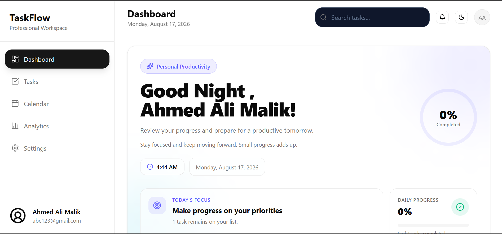
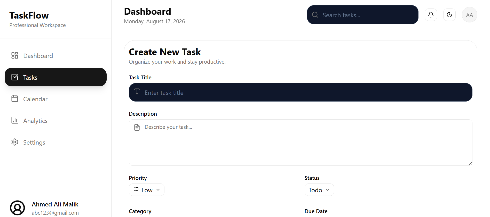
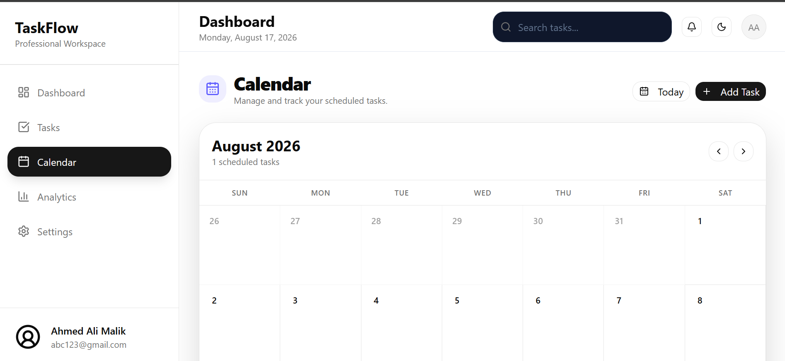
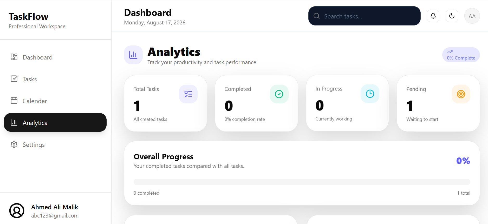
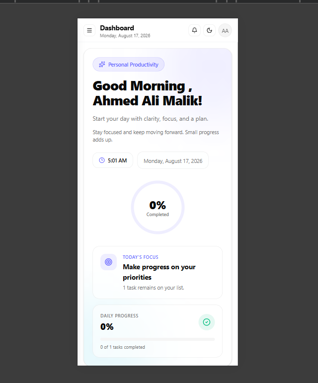
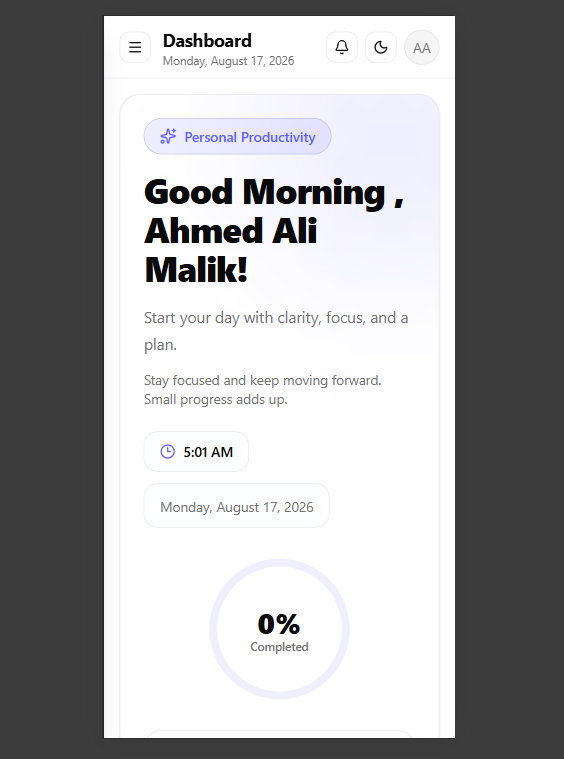

# TaskFlow

A modern, responsive task management application built with React, Redux Toolkit, Tailwind CSS, and Recharts. TaskFlow helps users organize tasks, manage deadlines, track progress, and visualize productivity through an intuitive dashboard.

## Live Demo

**Live Demo:** https://task-flow-gilt-psi.vercel.app/

## Screenshots

### Dashboard



### Tasks



### Calendar  



### Analytics



### Mobile Responsive Design


### mobile view 1


 ### mobile view 2

---

## Features

* Create, edit, and delete tasks
* Task status management

  * Todo
  * In Progress
  * Completed
* Task priority management

  * High
  * Medium
  * Low
* Task categories
* Task descriptions
* Due date management
* Prevent creating tasks with past due dates
* Interactive calendar
* View scheduled tasks by date
* Upcoming tasks section
* Recent activity tracking
* Dashboard statistics
* Productivity analytics
* Charts and data visualization
* Search and filtering
* Responsive design for desktop, tablet, and mobile
* Light and dark theme support
* Task detail modal
* Redux-based global state management
* Local browser-based data persistence

---

## Tech Stack

### Frontend

* React
* JavaScript
* Vite
* React Router
* Tailwind CSS

### State Management

* Redux Toolkit
* React Redux

### UI & Icons

* shadcn/ui
* Lucide React
* Framer Motion

### Data Visualization

* Recharts

### Development Tools

* Git
* GitHub
* VS Code
 ### Project Structure
```
TaskFlow/
│
├── public/
│   ├── screenshots/
│   │   ├── dashboard.png
│   │   ├── tasks.png
│   │   ├── calendar.png
│   │   ├── analytics.png
│   │   ├── mobile1.png
│   │   └── mobile2.png
│   │
│   └── favicon.jpg
│
├── src/
│   ├── app/
│   │   └── store.js
│   │
│   ├── components/
│   │   ├── dashboard/
│   │   ├── layout/
│   │   ├── task/
│   │   └── ui/
│   │
│   ├── features/
│   │   ├── search/
│   │   │   └── searchSlice.js
│   │   ├── theme/
│   │   │   └── themeSlice.js
│   │   └── todo/
│   │       └── todoSlice.js
│   │
│   ├── pages/
│   │   ├── DashboardPage.jsx
│   │   ├── TasksPage.jsx
│   │   ├── CalendarPage.jsx
│   │   ├── AnalyticsPage.jsx
│   │   └── SettingsPage.jsx
│   │
│   ├── lib/
│   │   └── utils.js
│   │
│   ├── App.jsx
│   ├── main.jsx
│   └── index.css
│
├── .gitignore
├── index.html
├── package.json
├── package-lock.json
├── vite.config.js
└── README.md
```
## Getting Started

### Prerequisites

Make sure you have the following installed:

* Node.js
* npm
* Git

### Installation

Clone the repository:

```bash
git clone https://github.com/YOUR_USERNAME/taskflow.git
```

Move into the project directory:

```bash
cd taskflow
```

Install dependencies:

```bash
npm install
```

Start the development server:

```bash
npm run dev
```

The application will be available at the local development URL shown in your terminal.

---

## Available Scripts

### Development

```bash
npm run dev
```

Starts the Vite development server.

### Production Build

```bash
npm run build
```

Creates an optimized production build.

### Preview

```bash
npm run preview
```

Runs the production build locally for preview.

---

## Task Management

TaskFlow provides a complete task management workflow.

Each task can contain:

```text
Title
Description
Priority
Status
Category
Due Date
Created Date
```

Tasks can be created, updated, deleted, filtered, sorted, and moved between different statuses.

---

## Calendar

The calendar provides a visual way to manage scheduled tasks.

Users can:

* Navigate between months
* Jump to today's date
* Select a specific date
* View scheduled tasks
* Open task details
* Add tasks directly from a date
* View existing tasks for the selected date

Past dates are protected from new task creation to prevent invalid due dates.

---

## Dashboard

The dashboard provides an overview of the user's productivity.

It includes:

* Total tasks
* Completed tasks
* Todo tasks
* In-progress tasks
* Upcoming tasks
* Recent activity
* Productivity charts
* Task search and filtering

---

## Analytics

The analytics section visualizes task activity and productivity using interactive charts.

This allows users to understand:

* Task completion
* Task distribution
* Productivity trends
* Task status statistics

---

## Responsive Design

TaskFlow is designed to work across different screen sizes.

### Supported Devices

* Desktop
* Laptop
* Tablet
* Mobile

The interface includes a responsive navigation system, adaptive cards, responsive grids, and mobile-friendly task management.

---

## State Management

TaskFlow uses **Redux Toolkit** for centralized application state management.

The Redux store manages important application data such as:

* Tasks
* Task status
* Task editing state
* Theme state
* Search state

This makes task updates consistent across different pages and components.

---

## Data Persistence

TaskFlow currently works as a frontend application and stores user/task-related data in browser storage where applicable.

No backend server is required to run the current version.

Future versions can introduce a dedicated backend and database for:

* User authentication
* Cloud data storage
* Multi-device synchronization
* User-specific task management
* API-based task operations

---

## Future Improvements

Planned improvements include:

* User authentication
* Backend API
* Database integration
* REST API
* User-specific task storage
* Cloud synchronization
* Drag-and-drop task management
* Advanced filtering
* Notifications and reminders
* Email notifications
* Recurring tasks
* Task collaboration
* AI-powered task suggestions
* Productivity insights
* Automated testing

---

## Learning Goals

TaskFlow was developed as a practical project to strengthen skills in:

* React application architecture
* Component-based development
* Redux state management
* Responsive UI development
* CRUD operations
* Routing
* Data visualization
* Modern frontend development
* Git and GitHub workflow

The project is also designed as a foundation for future full-stack development and AI-powered productivity features.

---

## Contributing

Contributions, suggestions, and improvements are welcome.

To contribute:

1. Fork the repository.
2. Create a new branch.

```bash
git checkout -b feature/your-feature
```

3. Make your changes.
4. Commit your changes.

```bash
git commit -m "Add your feature"
```

5. Push the branch.

```bash
git push origin feature/your-feature
```

6. Open a Pull Request.

---

## License

This project is currently available for educational and portfolio purposes.

---

## Author

**Ahmed Ali**

Software Engineering Student & Frontend Developer

### Skills

* React
* JavaScript
* Redux Toolkit
* Tailwind CSS
* PHP
* MySQL
* Python
* AI Prompt Engineering

### Connect

* GitHub: [Github](https://github.com/ahmed0-17)
* Portfolio: [Portfolio](https://ahmedalimalik-76.vercel.app)
* LinkedIn: [LinkedIn](www.linkedin.com/in/ahmed-ali-malik-23b919260)

---

## Project Status

**Status:** Active Development

TaskFlow is continuously being improved with new features, UI enhancements, and full-stack capabilities.
